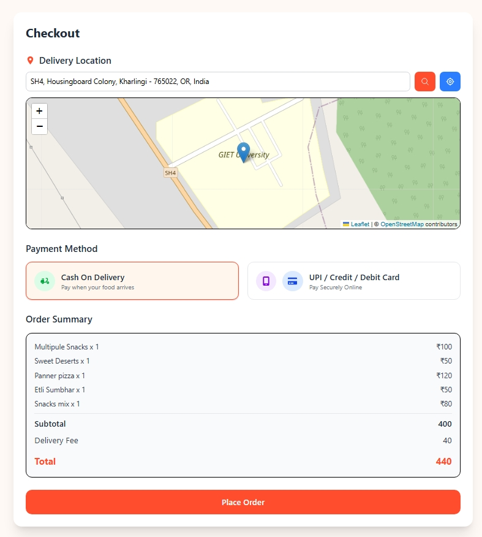
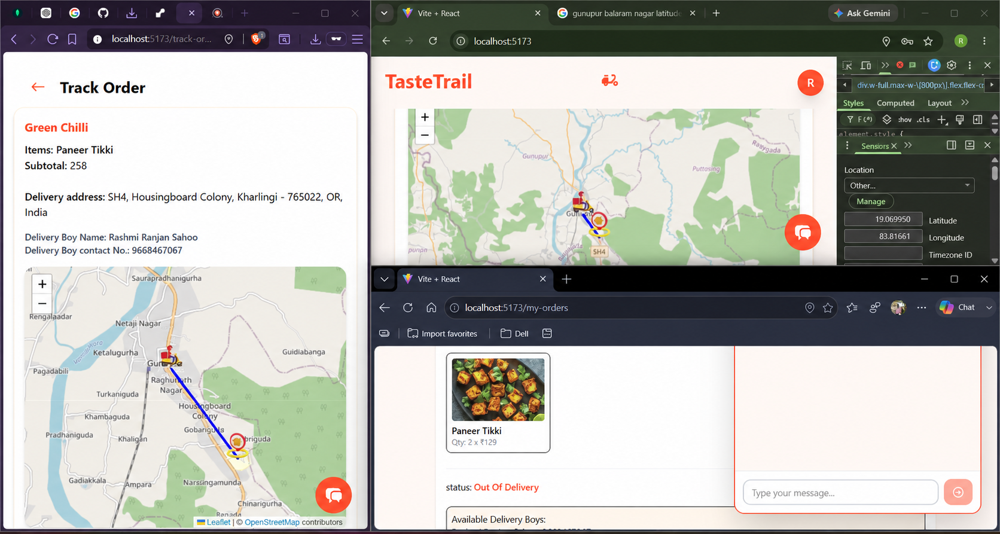
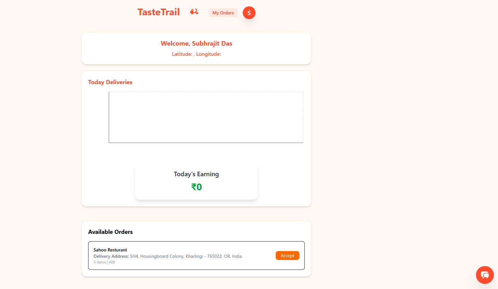

# 🍕 TasteTrial Food Delivery

[](https://react.dev)
[](https://expressjs.com)
[](https://www.mongodb.com)
[](https://socket.io)
[](https://redux-toolkit.js.org)
[](https://ai.google.dev)

> **TasteTrial Food Delivery** is a full-stack, multi-role food delivery platform connecting customers, restaurant owners, delivery personnel, and administrators. The platform features a seamless ordering flow, real-time delivery tracking, an AI-powered chatbot, and a comprehensive admin management panel.

---

## 📌 Overview

**TasteTrial Food Delivery** is a comprehensive food ordering ecosystem built with modern web technologies. The platform serves four distinct user types:

- **Customers** — Browse restaurants, order food, track deliveries in real-time
- **Restaurant Owners** — Manage shops, add/edit menu items, update order status
- **Delivery Boys** — Accept delivery assignments, navigate to customers, verify deliveries via OTP
- **Admins** — Full control over users, restaurants, orders, payments, coupons, banners, analytics, and more

Real-time features (live location tracking, order status updates, delivery assignments) are powered by **Socket.IO**. The platform also integrates an **AI chatbot** powered by Google Gemini for customer support.

---

## ✨ Features

### 👤 User (Customer) Features

- 🔐 Email/Password & Google Authentication (Firebase)
- 📱 OTP-based password reset flow
- 📍 Auto-detect city & location-based restaurant discovery
- 🏪 Browse shops & filter food items by category
- 🔍 Search for food items
- 🛒 Add to cart with quantity management
- 💳 Checkout with COD or Online Payment (Razorpay)
- 📦 Real-time order tracking with live delivery boy location on map
- ⭐ Rate food items after delivery
- 📋 View order history

### 🏪 Restaurant Owner Features

- 🏬 Create & manage restaurant/shop profile
- 🍕 Add, edit, and delete menu items (with images via Cloudinary)
- 📊 View all orders for your restaurant
- 🔄 Update order status (pending → preparing → out for delivery)
- 🗺️ Track assigned delivery boy on map

### 🛵 Delivery Boy Features

- 📍 Live location sharing via Socket.IO
- 📬 Receive & accept delivery assignments in real-time
- 🗺️ Navigate to restaurant & customer locations (Leaflet map)
- 🔐 OTP-based delivery confirmation
- 📈 View today's delivery statistics & earnings chart (Recharts)

### 🛡️ Admin Panel Features (16+ Pages)

- 📊 **Dashboard** — Overview of platform metrics
- 👥 **User Management** — View/manage all platform users
- 🏪 **Shop Owners Management** — Manage restaurant owners
- 🍕 **Food Management** — Manage all food items
- 📦 **Order Management** — View & manage all orders
- 💳 **Payment Management** — Track all transactions
- 🏷️ **Coupon Management** — Create & manage discount coupons
- ⭐ **Review Management** — Moderate user reviews
- 🚚 **Delivery Boy Management** — Manage delivery personnel
- 🏬 **Restaurant Management** — Manage all registered restaurants
- 📂 **Category Management** — Manage food categories
- 🖼️ **Banner Management** — Create promotional banners
- 🔔 **Notification Management** — Send push notifications
- 📈 **Analytics** — Charts & insights with Recharts
- 📑 **Reports** — Generate reports (PDF/Excel export)
- ⚙️ **Settings** — Platform configuration
- 📥 **Data Export** — Export reports to PDF/Excel

### 🤖 AI Chatbot

- 💬 AI-powered customer support using Google Gemini API
- 🔍 Grounded responses with web search capability
- 📜 Chat history preserved in session storage

---

## 👥 User Roles

| Role            | Description                              | Access Level                  |
| --------------- | ---------------------------------------- | ----------------------------- |
| `user`        | Customer — browses & orders food        | Frontend only                 |
| `owner`       | Restaurant owner — manages shop & items | Frontend (Owner Dashboard)    |
| `deliveryBoy` | Delivery personnel — delivers orders    | Frontend (Delivery Dashboard) |
| `admin`       | Platform administrator                   | Admin Panel (`/admin/*`)    |

---

## 🧰 Tech Stack

### Frontend (Main)

| Technology                            | Purpose                 |
| ------------------------------------- | ----------------------- |
| ⚛️**React 19**                | UI framework            |
| ⚡**Vite 7**                    | Build tool              |
| 🧭**React Router 7**            | Client-side routing     |
| 🪝**Redux Toolkit 2**           | State management        |
| 🎨**Tailwind CSS 4**            | Utility-first styling   |
| 🗺️**Leaflet + react-leaflet** | Interactive maps        |
| 📊**Recharts**                  | Charts & analytics      |
| 🔌**Socket.IO Client**          | Real-time communication |
| 🔥**Firebase**                  | Google Authentication   |
| 💳**Razorpay**                  | Payment gateway         |
| 📦**Axios**                     | HTTP client             |
| 🌀**react-spinners**            | Loading indicators      |
| 🔤**react-icons**               | Icon library            |

### Backend (Main)

| Technology                        | Purpose                |
| --------------------------------- | ---------------------- |
| 🟢**Node.js**               | Runtime environment    |
| 🌐**Express 5**             | Web framework          |
| 🧠**MongoDB + Mongoose**    | Database & ODM         |
| 🔐**bcryptjs**              | Password hashing       |
| 🎫**jsonwebtoken (JWT)**    | Authentication tokens  |
| 🍪**cookie-parser**         | Cookie management      |
| 🔌**Socket.IO 4**           | WebSocket server       |
| 🖼️**Multer + Cloudinary** | Image upload & hosting |
| ✉️**Nodemailer**          | Email sending (OTP)    |
| 💳**Razorpay SDK**          | Payment processing     |
| 🌿**dotenv**                | Environment variables  |

### Admin Panel

#### Admin Frontend

| Technology                          | Purpose          |
| ----------------------------------- | ---------------- |
| ⚛️**React 19**              | UI framework     |
| ⚡**Vite 6**                  | Build tool       |
| 🪝**Redux Toolkit 2**         | State management |
| 🎨**Tailwind CSS 4**          | Styling          |
| 📊**Recharts**                | Analytics charts |
| 📥**xlsx**                    | Excel export     |
| 📄**jspdf + jspdf-autotable** | PDF export       |
| 🔔**react-toastify**          | Notifications    |
| 📍**react-icons**             | Icons            |

#### Admin Backend

| Technology                        | Purpose            |
| --------------------------------- | ------------------ |
| 🟢**Node.js + Express 5**   | Web framework      |
| 🧠**MongoDB + Mongoose**    | Database           |
| 🔐**bcryptjs + JWT**        | Authentication     |
| 🖼️**Multer + Cloudinary** | Image uploads      |
| ✉️**Nodemailer**          | Emails             |
| 🌿**dotenv**                | Environment config |

### Additional Modules

| Module                   | Technology                                       |
| ------------------------ | ------------------------------------------------ |
| 🤖**Chatbot**      | Google Gemini API (`gemini-2.5-flash-preview`) |
| 🎬**Video Module** | HTML5 Video streaming                            |

---

## 🗂️ Project Structure

```
TasteTrial-Food-Delivery/
│
├── 📁 backend/                          # Main Backend API Server
│   ├── 📁 config/
│   │   └── db.js                        # MongoDB connection
│   ├── 📁 controllers/
│   │   ├── auth.controllers.js          # Sign up/in, OTP, password reset
│   │   ├── user.controllers.js          # User profile, location
│   │   ├── shop.controllers.js          # Shop CRUD
│   │   ├── item.controllers.js          # Food items CRUD, search, rating
│   │   ├── order.controllers.js         # Order placement, delivery, tracking
│   │   ├── admin.*.controllers.js       # Admin sub-controllers
│   ├── 📁 middlewares/
│   │   ├── isAuth.js                    # JWT authentication middleware
│   │   ├── isAdmin.js                   # Admin authorization middleware
│   │   └── multer.js                    # File upload configuration
│   ├── 📁 models/
│   │   ├── user.model.js                # User (customer, owner, deliveryBoy)
│   │   ├── shop.model.js                # Restaurant/Shop
│   │   ├── item.model.js                # Food menu items
│   │   ├── order.model.js               # Orders with nested shop orders
│   │   ├── deliveryAssignment.model.js  # Delivery assignments
│   │   ├── coupon.model.js              # Discount coupons
│   │   ├── banner.model.js              # Promotional banners
│   │   ├── review.model.js              # User reviews
│   │   ├── notification.model.js        # Notifications
│   │   ├── settings.model.js            # Platform settings
│   │   └── admin.model.js               # Admin accounts
│   ├── 📁 routes/
│   │   ├── auth.routes.js
│   │   ├── user.routes.js
│   │   ├── shop.routes.js
│   │   ├── item.routes.js
│   │   ├── order.routes.js
│   │   └── admin.routes.js
│   ├── 📁 utils/
│   │   ├── cloudinary.js                # Cloudinary configuration
│   │   ├── mail.js                      # Nodemailer email service
│   │   └── token.js                     # JWT token generation
│   ├── socket.js                        # Socket.IO event handlers
│   ├── index.js                         # Express server entry point
│   └── package.json
│
├── 📁 frontend/                         # Main Frontend (User/Owner/Delivery)
│   ├── 📁 public/
│   ├── 📁 src/
│   │   ├── 📁 api/                      # API service configurations
│   │   ├── 📁 assets/                   # Images, icons
│   │   ├── 📁 components/
│   │   │   ├── Nav.jsx                  # Navigation bar
│   │   │   ├── UserDashboard.jsx        # Customer landing page
│   │   │   ├── OwnerDashboard.jsx       # Restaurant owner dashboard
│   │   │   ├── DeliveryBoy.jsx          # Delivery boy dashboard
│   │   │   ├── OwnerItemCard.jsx        # Owner's food item card
│   │   │   ├── OwnerOrderCard.jsx       # Owner's order management card
│   │   │   ├── UserOrderCard.jsx        # Customer order card
│   │   │   ├── FoodCard.jsx             # Food item display card
│   │   │   ├── CategoryCard.jsx         # Category display card
│   │   │   ├── CartItemCard.jsx         # Cart item component
│   │   │   ├── DeliveryBoyTracking.jsx  # Live delivery tracking map
│   │   │   └── Chatbot.jsx             # AI Chatbot component
│   │   ├── 📁 hooks/                    # Custom React hooks
│   │   ├── 📁 pages/
│   │   │   ├── SignUp.jsx
│   │   │   ├── SignIn.jsx
│   │   │   ├── ForgotPassword.jsx
│   │   │   ├── Home.jsx
│   │   │   ├── CreateEditShop.jsx
│   │   │   ├── AddItem.jsx
│   │   │   ├── EditItem.jsx
│   │   │   ├── CartPage.jsx
│   │   │   ├── CheckOut.jsx
│   │   │   ├── OrderPlaced.jsx
│   │   │   ├── MyOrders.jsx
│   │   │   ├── TrackOrderPage.jsx
│   │   │   └── Shop.jsx
│   │   ├── 📁 redux/
│   │   │   ├── store.js                 # Redux store
│   │   │   ├── userSlice.js             # User state
│   │   │   ├── ownerSlice.js            # Owner state
│   │   │   └── mapSlice.js              # Map state
│   │   ├── App.jsx                      # Root component with routes
│   │   ├── main.jsx                     # Entry point
│   │   ├── index.css                    # Global styles
│   │   ├── category.js                  # Food categories data
│   │   └── firebase.js                  # Firebase config
│   ├── index.html
│   ├── vite.config.js
│   ├── package.json
│   └── README.md
│
├── 📁 admin/                            # Admin Panel
│   ├── 📁 backend/
│   │   ├── 📁 config/
│   │   │   └── db.js
│   │   ├── 📁 controllers/              # Admin-specific controllers
│   │   ├── 📁 middlewares/
│   │   │   └── isAdmin.js
│   │   ├── 📁 models/                   # Admin models (shared + admin-specific)
│   │   ├── 📁 routes/
│   │   │   └── admin.routes.js
│   │   ├── 📁 utils/
│   │   │   ├── cloudinary.js
│   │   │   └── mail.js
│   │   ├── index.js
│   │   └── package.json
│   │
│   └── 📁 frontend/
│       ├── 📁 src/
│       │   ├── 📁 api/                  # Admin API service
│       │   ├── 📁 components/
│       │   │   ├── Layout.jsx           # Sidebar + Navbar layout
│       │   │   └── ProtectedRoute.jsx   # Auth guard
│       │   ├── 📁 pages/                # 16+ Admin management pages
│       │   │   ├── Login.jsx
│       │   │   ├── ForgotPassword.jsx
│       │   │   ├── Dashboard.jsx
│       │   │   ├── Users.jsx
│       │   │   ├── ShopOwners.jsx
│       │   │   ├── DeliveryBoys.jsx
│       │   │   ├── Restaurants.jsx
│       │   │   ├── Foods.jsx
│       │   │   ├── Categories.jsx
│       │   │   ├── Orders.jsx
│       │   │   ├── Payments.jsx
│       │   │   ├── Coupons.jsx
│       │   │   ├── Reviews.jsx
│       │   │   ├── Banners.jsx
│       │   │   ├── Notifications.jsx
│       │   │   ├── Reports.jsx
│       │   │   ├── Analytics.jsx
│       │   │   └── Settings.jsx
│       │   ├── 📁 redux/
│       │   │   └── adminSlice.js
│       │   ├── App.jsx
│       │   ├── main.jsx
│       │   └── index.css
│       ├── index.html
│       ├── vite.config.js
│       └── package.json
│   └── TODO.md                          # Admin development checklist
│
├── 🤖 chatbot.html                      # AI Chatbot (standalone HTML)
│
├── 📸 Screenshort/                      # Application screenshots
│
└── 📄 README.md                        # This file
```

---

## 🔧 Installation

### ✅ 1) Prerequisites

- **Node.js** v18+ (LTS recommended)
- **MongoDB** — Local instance or [MongoDB Atlas](https://www.mongodb.com/atlas) (free tier)
- **Git** (optional)
- A package manager: **npm** (comes with Node.js)

---

### 🧱 2) Backend Setup

```bash
# Navigate to backend directory
cd backend

# Install dependencies
npm install

# Create .env file (see Environment Variables section below)
# Add your configuration values

# Start development server
npm run dev
```

> Backend runs at: **http://localhost:8000**

---

### 🎨 3) Frontend Setup

```bash
# Open a new terminal, navigate to frontend
cd frontend

# Install dependencies
npm install

# Start development server
npm run dev
```

> Frontend runs at: **http://localhost:5173**

---

### 🧱 4) Admin Backend Setup

```bash
# Navigate to admin backend
cd admin/backend

# Install dependencies
npm install

# Create .env file (see Environment Variables section)

# Start development server
npm run dev
```

> Admin Backend runs at: **http://localhost:8001** (or your configured port)

---

### 🎨 5) Admin Frontend Setup

```bash
# Navigate to admin frontend
cd admin/frontend

# Install dependencies
npm install

# Start development server
npm run dev
```

> Admin Frontend runs at: **http://localhost:5174**

---

## 🔐 Environment Variables

### Backend (`backend/.env`)

```bash
# ─── Server ───
PORT=8000
NODE_ENV=development                # "development" or "production"

# ─── Database ───
MONGODB_URL=mongodb+srv://<user>:<password>@cluster.xxxxx.mongodb.net/TasteTrial-food-delivery

# ─── JWT ───
JWT_SECRET=your_jwt_secret_key_here

# ─── Cloudinary (Image Upload) ───
CLOUDINARY_CLOUD_NAME=your_cloud_name
CLOUDINARY_API_KEY=your_api_key
CLOUDINARY_API_SECRET=your_api_secret

# ─── Email (Nodemailer) ───
MAIL_HOST=smtp.gmail.com
MAIL_PORT=587
MAIL_USER=your_email@gmail.com
MAIL_PASS=your_app_password          # Use Gmail App Password (not regular password)

# ─── Razorpay (Payments) ───
RAZORPAY_KEY_ID=rzp_live_xxxxxxxx
RAZORPAY_KEY_SECRET=xxxxxxxxxxxxxx
```

### Admin Backend (`admin/backend/.env`)

```bash
# ─── Server ───
PORT=8001
NODE_ENV=development

# ─── Database ───
MONGODB_URL=mongodb+srv://<user>:<password>@cluster.xxxxx.mongodb.net/TasteTrial-food-delivery

# ─── JWT ───
JWT_SECRET=your_jwt_secret_key_here   # Can be different from main backend

# ─── Cloudinary ───
CLOUDINARY_CLOUD_NAME=your_cloud_name
CLOUDINARY_API_KEY=your_api_key
CLOUDINARY_API_SECRET=your_api_secret

# ─── Email ───
MAIL_HOST=smtp.gmail.com
MAIL_PORT=587
MAIL_USER=your_email@gmail.com
MAIL_PASS=your_app_password
```

### Frontend (`frontend/.env`)

```bash
# ─── Firebase (Google Auth) ───
VITE_FIREBASE_APIKEY=your_firebase_api_key

# ─── Backend URL ───
# For development (default is http://localhost:8000 in App.jsx)
# Override if needed:
# VITE_SERVER_URL=http://localhost:8000
```

---

## ▶️ How to Run

### Full Development Setup (4 terminals needed)

1. **Terminal 1 — Main Backend:**

   ```bash
   cd backend && npm run dev
   ```
2. **Terminal 2 — Main Frontend:**

   ```bash
   cd frontend && npm run dev
   ```
3. **Terminal 3 — Admin Backend:**

   ```bash
   cd admin/backend && npm run dev
   ```
4. **Terminal 4 — Admin Frontend:**

   ```bash
   cd admin/frontend && npm run dev
   ```

### Access Points

| Service              | URL                             |
| -------------------- | ------------------------------- |
| 🖥️ Main Frontend   | http://localhost:5173           |
| 🛡️ Admin Panel     | http://localhost:5174/admin     |
| 🌐 Main Backend API  | http://localhost:8000/api       |
| 🌐 Admin Backend API | http://localhost:8001/api/admin |
| 🤖 Chatbot           | Open`chatbot.html` in browser |

> **Note:** Make sure MongoDB is running before starting any backend server.

---

## 🌐 API Endpoints

### Base URL: `http://localhost:8000/api`

### 🔐 Auth

| Method | Endpoint                 | Auth | Description                 |
| ------ | ------------------------ | ---- | --------------------------- |
| POST   | `/auth/signup`         | ✅   | Register new user           |
| POST   | `/auth/signin`         | ✅   | Login user                  |
| GET    | `/auth/signout`        | ✅   | Logout (clears cookie)      |
| POST   | `/auth/send-otp`       | ✅   | Send OTP for password reset |
| POST   | `/auth/verify-otp`     | ✅   | Verify OTP                  |
| POST   | `/auth/reset-password` | ✅   | Reset password (after OTP)  |
| POST   | `/auth/google-auth`    | ✅   | Google OAuth sign in/up     |

### 👤 User

| Method | Endpoint                  | Auth | Description                        |
| ------ | ------------------------- | ---- | ---------------------------------- |
| GET    | `/user/current`         | ✅   | Get current user profile           |
| POST   | `/user/update-location` | ✅   | Update user's location coordinates |
| GET    | `/user/get-all`         | ✅   | Get all users (Admin)              |

### 🏪 Shop / Restaurant

| Method | Endpoint                    | Auth | Description           |
| ------ | --------------------------- | ---- | --------------------- |
| POST   | `/shop/create-edit`       | ✅   | Create or update shop |
| GET    | `/shop/get-my`            | ✅   | Get owner's shop      |
| GET    | `/shop/get-by-city/:city` | ✅   | Get shops by city     |
| GET    | `/shop/get-all`           | ✅   | Get all shops (Admin) |

### 🍕 Food Items

| Method | Endpoint                      | Auth | Description                  |
| ------ | ----------------------------- | ---- | ---------------------------- |
| POST   | `/item/add-item`            | ✅   | Add new food item            |
| POST   | `/item/edit-item/:itemId`   | ✅   | Edit existing item           |
| GET    | `/item/get-by-id/:itemId`   | ✅   | Get item details             |
| GET    | `/item/delete/:itemId`      | ✅   | Delete item                  |
| GET    | `/item/get-by-city/:city`   | ✅   | Get items by city            |
| GET    | `/item/get-by-shop/:shopId` | ✅   | Get items by shop            |
| GET    | `/item/search-items`        | ✅   | Search items (query:`?q=`) |
| POST   | `/item/rating`              | ✅   | Rate a food item             |

### 📦 Orders & Delivery

| Method | Endpoint                                  | Auth | Description                                       |
| ------ | ----------------------------------------- | ---- | ------------------------------------------------- |
| POST   | `/order/place-order`                    | ✅   | Place a new order                                 |
| POST   | `/order/verify-payment`                 | ✅   | Verify Razorpay payment                           |
| GET    | `/order/my-orders`                      | ✅   | Get user's orders                                 |
| GET    | `/order/get-assignments`                | ✅   | Get available delivery assignments (Delivery Boy) |
| GET    | `/order/get-current-order`              | ✅   | Get current delivery assignment                   |
| POST   | `/order/send-delivery-otp`              | ✅   | Send OTP for delivery confirmation                |
| POST   | `/order/verify-delivery-otp`            | ✅   | Verify delivery OTP                               |
| POST   | `/order/update-status/:orderId/:shopId` | ✅   | Update order status (Owner)                       |
| GET    | `/order/accept-order/:assignmentId`     | ✅   | Accept delivery assignment                        |
| GET    | `/order/get-order-by-id/:orderId`       | ✅   | Get order details by ID                           |
| GET    | `/order/get-today-deliveries`           | ✅   | Get today's delivery stats (Delivery Boy)         |

### 🛡️ Admin API

**Base URL:** `http://localhost:8001/api/admin`

| Method | Endpoint                 | Auth | Description            |
| ------ | ------------------------ | ---- | ---------------------- |
| POST   | `/admin/auth/login`    | ✅   | Admin login            |
| POST   | `/admin/auth/logout`   | ✅   | Admin logout           |
| GET    | `/admin/auth/profile`  | ✅   | Get admin profile      |
| GET    | `/admin/dashboard`     | ✅   | Dashboard stats        |
| GET    | `/admin/users`         | ✅   | List all users         |
| GET    | `/admin/shop-owners`   | ✅   | List all shop owners   |
| GET    | `/admin/delivery-boys` | ✅   | List all delivery boys |
| GET    | `/admin/restaurants`   | ✅   | List all restaurants   |
| GET    | `/admin/foods`         | ✅   | List all food items    |
| GET    | `/admin/categories`    | ✅   | List all categories    |
| GET    | `/admin/orders`        | ✅   | List all orders        |
| GET    | `/admin/payments`      | ✅   | List all payments      |
| GET    | `/admin/coupons`       | ✅   | Manage coupons         |
| GET    | `/admin/banners`       | ✅   | Manage banners         |
| GET    | `/admin/reviews`       | ✅   | Manage reviews         |
| GET    | `/admin/notifications` | ✅   | Manage notifications   |
| GET    | `/admin/reports`       | ✅   | Generate reports       |
| GET    | `/admin/analytics`     | ✅   | Platform analytics     |
| GET    | `/admin/settings`      | ✅   | Platform settings      |

> 🔐 Most admin endpoints support CRUD operations — POST to create, PUT to update, DELETE to remove.

---

## 📸 Screenshots

### Authentication

| Page              | Screenshot                                     |
| ----------------- | ---------------------------------------------- |
| **Sign Up** |  |
| **Sign In** |  |

### User Section

| Page                                            | Screenshot                                                 |
| ----------------------------------------------- | ---------------------------------------------------------- |
| **User Dashboard — Browse shops & food** |              |
| **Browse Restaurant Food Items**          |   |
| **Add to Cart**                           |        |
| **Checkout Page**                         |                    |
| **Order Confirmed**                       |  |
| **My Orders Page**                        |           |
| **Track Order — Live Map**               |   |
| **Multi-page Navigation**                 |        |

### Restaurant Owner Section

| Page                                    | Screenshot                                                                                |
| --------------------------------------- | ----------------------------------------------------------------------------------------- |
| **Owner Dashboard**               |                                 |
| **Add New Food Item**             |                   |
| **Owner Cart / Order Management** |                                |
| **Update Order Status**           |  |

### Delivery Boy Section

| Page                                    | Screenshot                                                           |
| --------------------------------------- | -------------------------------------------------------------------- |
| **Delivery Dashboard**            |                           |
| **Accept Delivery Assignment**    |  |
| **OTP Verification for Delivery** |                           |
| **Order Completed**               |            |

### Admin Panel

| Page                            | Screenshot                                                       |
| ------------------------------- | ---------------------------------------------------------------- |
| **Admin Sign In**         |      |
| **Admin Profile**         |     |
| **Dashboard**             |                 |
| **Full Admin Panel**      |   |
| **User Management**       |      |
| **Restaurant Management** |  |
| **Food Management**       |             |
| **Order Management**      |     |
| **Payment Management**    |       |

---

## 🤖 AI Chatbot

TasteTrial Food Delivery includes an **AI-powered chatbot** built with Google Gemini API.

### Features

- 💬 Natural language conversation for customer support
- 🔍 **Grounded search** — fetches real-time web data via Google Search grounding
- 📜 **Chat history** — preserved across page refreshes via sessionStorage
- 📱 **Responsive design** — Tailwind CSS with mobile-first approach
- ♻️ **Auto-retry** — Exponential backoff for API rate limits

### How to Use

1. Open `chatbot.html` in your browser
2. Or, access the chatbot component within the main frontend app (bottom-right corner when logged in)
3. Type your questions about the platform, orders, or anything else

> **Note:** The chatbot uses a demo API key embedded in the HTML file. For production, replace it with your own Google Gemini API key from [Google AI Studio](https://makersuite.google.com/app/apikey).

---

## 🎬 Video Demo

A video demonstration of the platform is available:

- 📁 **Location:** `video/` directory
- 🌐 **Open:** `video/index.html` in a browser
- 🎥 **Preview:** 

The video module provides a clean, custom HTML5 video player with controls, ready to showcase the platform's features.

---

## 🛡️ Security Features

| Feature                          | Implementation                                                               |
| -------------------------------- | ---------------------------------------------------------------------------- |
| 🔐**Password Hashing**     | bcryptjs with salt rounds = 10                                               |
| 🎫**JWT Authentication**   | JSON Web Tokens stored in HTTP-only cookies                                  |
| 🍪**HTTP-only Cookies**    | Prevents XSS attacks on authentication tokens                                |
| ✅**OTP Verification**     | Time-limited OTP for password resets (5 min expiry)                          |
| 🔒**Route Protection**     | `isAuth` middleware for authenticated routes, `isAdmin` for admin routes |
| 🔑**Admin Isolation**      | Separate backend server for admin panel                                      |
| 🧪**Input Validation**     | Basic validation on signup (password length, mobile length)                  |
| 🛡️**CORS Configuration** | Whitelist of allowed origins                                                 |
| 🚚**Delivery OTP**         | OTP-based delivery confirmation prevents fraud                               |

---

## 🚀 Deployment

### Deploy Main Frontend (Vercel)

```bash
cd frontend

# Build the project
npm run build

# Deploy to Vercel (using Vercel CLI or Git integration)
vercel --prod
```

**Vercel Configuration:** The `vercel.json` file is already included in the frontend directory.

> ⚠️ **Important:** Update the `serverUrl` in `frontend/src/App.jsx` to point to your production backend URL instead of `http://localhost:8000`.

### Deploy Main Backend (Render / Railway / Fly.io)

1. Push to GitHub
2. Create a new Web Service on [Render](https://render.com)
3. Set the **Root Directory** to `backend`
4. Set **Build Command:** `npm install`
5. Set **Start Command:** `npm start`
6. Add all environment variables from the `.env` section
7. Deploy

### Deploy Admin Frontend (Vercel)

```bash
cd admin/frontend

# Build
npm run build

# Deploy
vercel --prod
```

### Deploy Admin Backend (Render / Railway)

Same as Main Backend, but set:

- **Root Directory:** `admin/backend`
- **Start Command:** `npm start`

### Socket.IO CORS Configuration

When deploying, update the `allowedOrigins` array in both:

- `backend/index.js` (line ~15)
- `admin/backend/index.js`

Add your production frontend URLs:

```javascript
const allowedOrigins = [
  "https://your-frontend.vercel.app",
  "https://your-admin.vercel.app"
];
```

---

## 🔮 Future Improvements

- [ ] 🧪 **Automated Tests** — Add unit & integration tests (Jest, React Testing Library)
- [ ] 📚 **API Documentation** — Swagger/OpenAPI documentation for all endpoints
- [ ] 🚦 **Rate Limiting** — Prevent abuse on auth endpoints
- [ ] 🔄 **Refresh Tokens** — Implement token refresh mechanism for better session management
- [ ] 👥 **Enhanced RBAC** — Fine-grained role-based access control with permissions
- [ ] 🌍 **Environment URLs** — Replace hardcoded URLs with environment variables on frontend
- [ ] ⚡ **Performance Optimization** — Caching (Redis), query optimization, lazy loading
- [ ] 📱 **PWA Support** — Progressive Web App for offline capabilities
- [ ] 💬 **Live Chat** — Real-time chat between customers and restaurant owners
- [ ] 🗺️ **Multi-City Support** — Expand location-based features across more cities
- [ ] 📊 **Advanced Analytics** — ML-based insights, sales forecasting, customer behavior analysis
- [ ] 🧾 **GST Invoice Generation** — Auto-generate tax invoices for orders

---

## 👨‍💻 Authors

| Name                          | Role      |
| ----------------------------- | --------- |
| **Rashmi Ranjan Sahoo** | Developer |
| **Densi Thumahar**      | Developer |

---

## 📝 License

This project is licensed under the **ISC License**.

---

> **Built with ❤️ using React, Node.js, MongoDB, Socket.IO, and Google Gemini**
